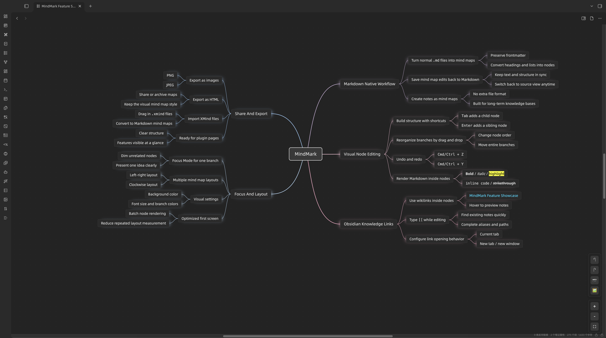
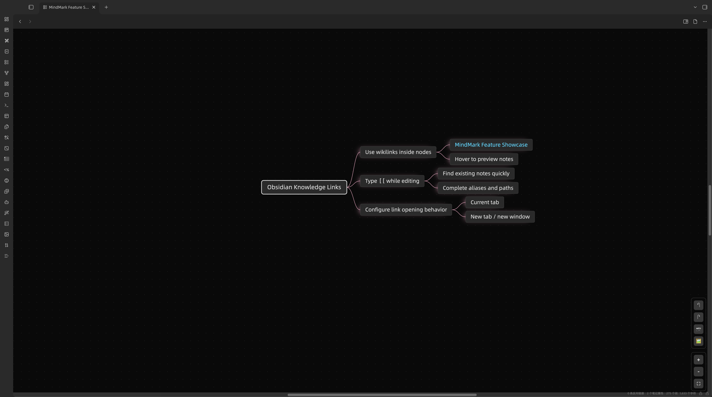
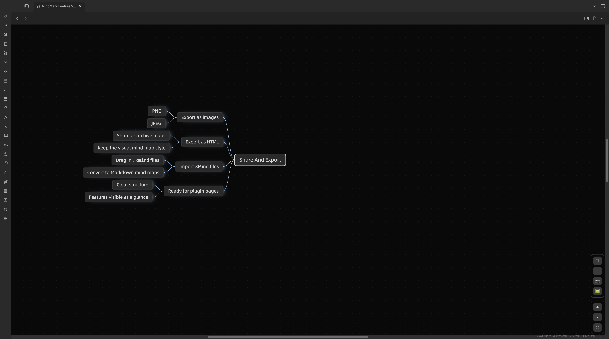

[English](README.md)

# MindMark

MindMark 是一个 Obsidian 插件，用于把 Markdown 笔记作为可视化思维导图编辑。

它不会引入新的专有文件格式。你的内容仍然保存在普通 Markdown 文件中，可以在文本视图和思维导图视图之间切换。



## 功能特性

- 创建基于 Markdown 的思维导图笔记。
- 将带有指定 frontmatter 的 Markdown 文件直接作为导图打开。
- 在 MindMap 视图和 Markdown 视图之间切换。
- 支持双击和快捷键编辑节点。
- 支持新增子节点、同级节点、删除节点、移动节点和整理分支。
- 支持撤销和重做。
- 节点内可渲染常见 Markdown 格式，包括加粗、斜体、高亮、删除线、行内代码、链接和嵌入。
- 支持在节点中渲染和打开 Obsidian 双链。
- 支持双链悬停预览。
- 编辑节点时输入 `[[` 可触发文件联想。
- 支持拖拽调整节点顺序和层级。
- 支持展开和折叠分支。
- 支持 Focus Mode 聚焦当前分支。
- 支持配置画布尺寸、背景色、字体大小、布局方向、分支颜色、专注模式遮罩透明度和双链打开方式。
- 支持拖拽导入 `.xmind` 文件。
- 支持导出 PNG、JPEG 和 HTML。

## 截图

### Obsidian 知识联动



### 分享与导出



## Markdown 格式

MindMark 会识别包含以下 frontmatter 的 Markdown 文件：

```markdown
---
mindmap-plugin: basic
---
```

标题和无序列表会转换为导图结构：

```markdown
# Project Plan

## Research
- Collect references
- Summarize findings

## Execution
- Draft outline
- Review milestones
```

文件仍然是 Markdown 文件。导图中的编辑会在保存时序列化回 Markdown。

## 主要命令

MindMark 注册了这些主要命令：

- `Create New MindMap`
- `Set to mindmap view`
- `Set to markdown view`
- `Toggle to markdown or mindmap`
- `Insert child`
- `Add sibling/end editing`
- `Undo`
- `Redo`
- `Export to PNG`
- `Export to JPEG`
- `Export to HTML`

## 快捷键

- `Tab`：新增子节点。
- `Enter`：新增同级节点或结束编辑。
- `Delete` / `Backspace`：删除选中节点。
- `Space` / 双击：编辑选中节点。
- 方向键：在节点之间导航。
- `Home`：选择根节点。
- `F`：切换当前节点的 Focus Mode。
- `Esc`：退出 Focus Mode 或取消编辑。
- `Cmd/Ctrl + Z`：撤销。
- `Cmd/Ctrl + Y`：重做。
- `Cmd/Ctrl + 鼠标滚轮`：缩放。

## 安装

### 社区插件

当 MindMark 通过 Obsidian 社区插件审核后：

1. 打开 Obsidian 设置。
2. 进入 Community plugins。
3. 搜索 `MindMark`。
4. 安装并启用插件。

### 手动安装

1. 从 GitHub Release 下载 `manifest.json`、`main.js` 和 `styles.css`。
2. 在你的库中创建 `.obsidian/plugins/mindmark` 文件夹。
3. 将这三个文件放入该文件夹。
4. 重启 Obsidian 或重新加载社区插件。
5. 在 Community plugins 中启用 MindMark。

## 桌面端支持

MindMark 当前按桌面端插件发布。编辑流程使用键盘导航、拖拽、悬停预览和基于 Electron 的导出截图能力。

## 已知限制

- MindMark 使用 Markdown 作为源格式，不是独立的二进制导图格式。
- `.xmind` 目前是导入能力，不是双向同步。
- HTML 导出会创建包含导图图片的独立 HTML 文件。
- 超大导图仍可能需要一定渲染时间，但首屏渲染流程已经针对重复布局测量做过优化。

## 开发

安装依赖：

```bash
npm install
```

构建：

```bash
npm run build
```

构建产物：

- `main.js`
- `styles.css`
- `manifest.json`

## License

MindMark 使用 MIT License 发布。详见 [LICENSE.md](LICENSE.md)。
